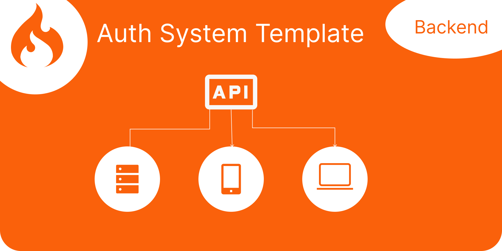
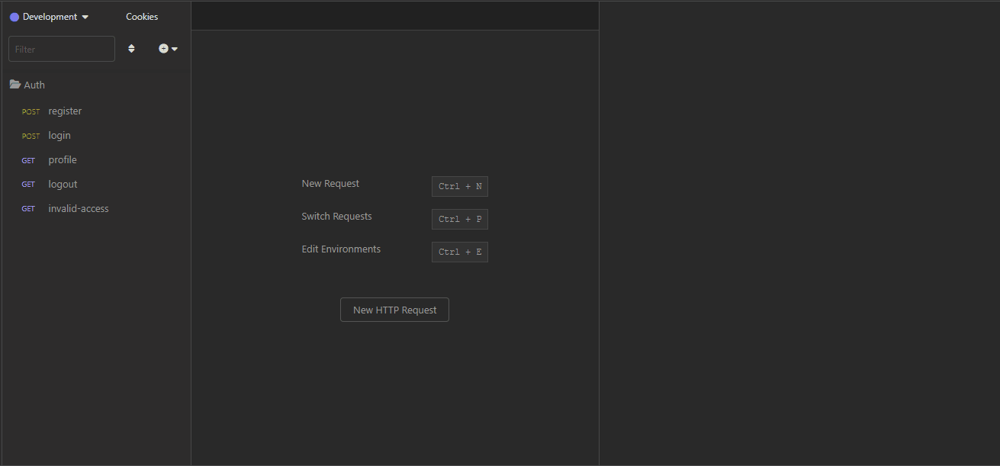
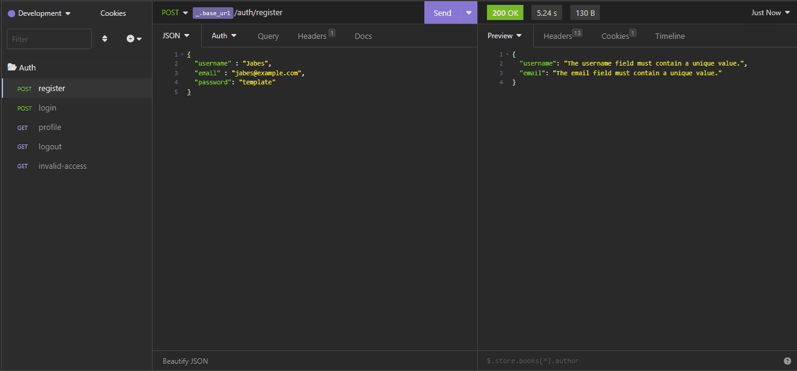
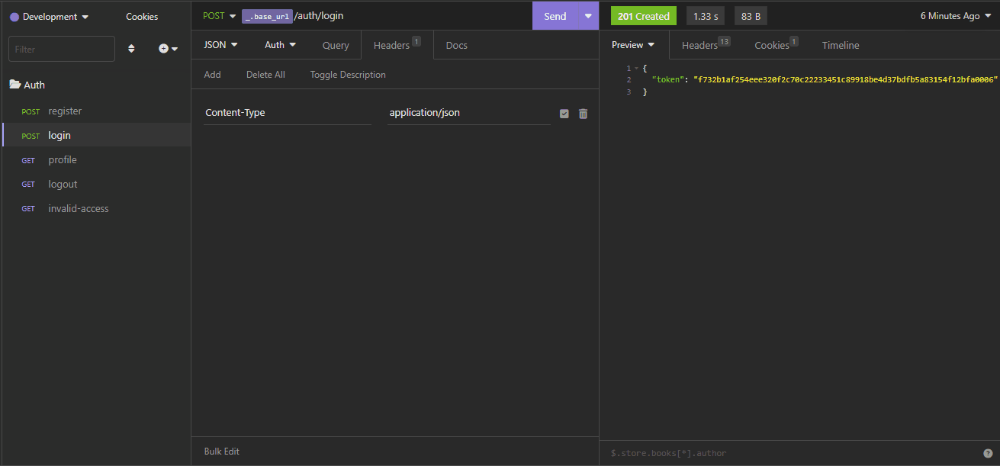
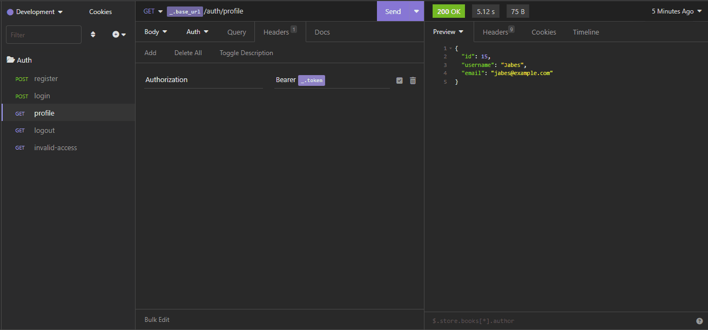
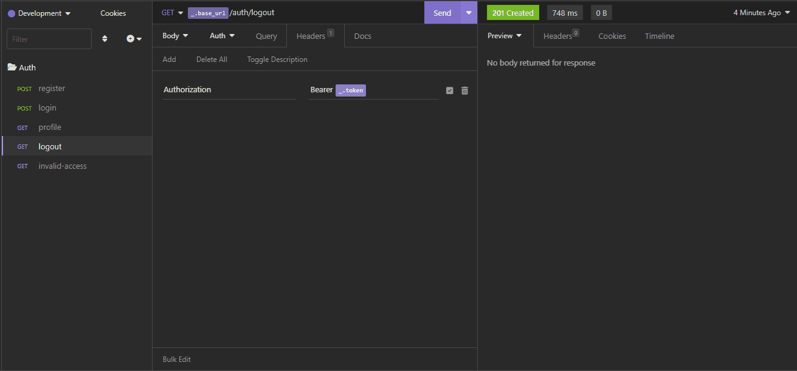
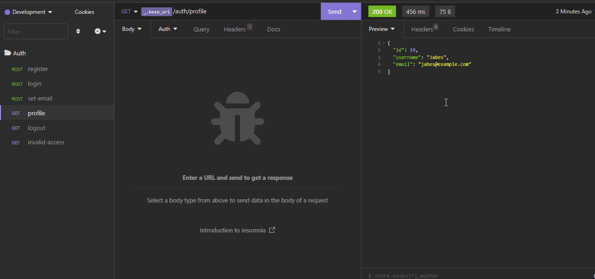
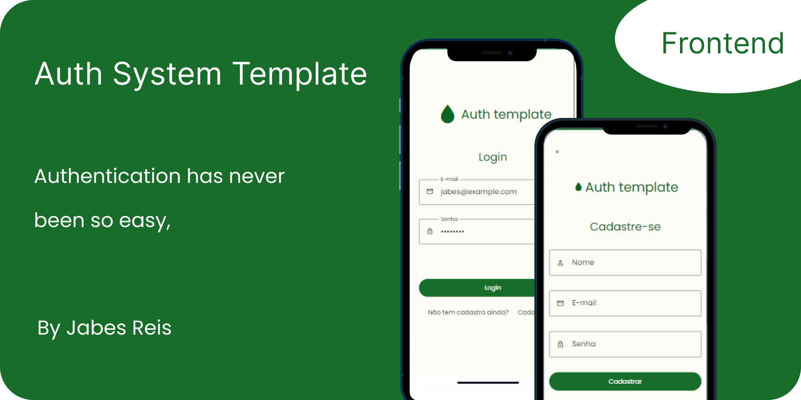

<h1 align="center"> Auth Template - Auth made easy
</h1>
<p align="center">

</p>
</br>


## :bookmark_tabs:Summary

- [Introduction](#Introduction)

- [Features and some gif's ](#features-and-demo)
    - [Register ](#register)
    - [Login ](#login)
    - [Profile ](#profile)
    - [Logout ](#logout)
    - [update email](#update-email)
- [Technologies](#Technologies)
- [Installation](#Installation)
- [My opinion about this project](#opinion)
- [Related Projects](#related-projects)
- [To do](#to-do)


</br>
<div id="Introduction">

## :page_facing_up:Introduction

This project is an back end template for authentication in codeIgniter 4 to allow user to perform the basic actions of an authentication system.

I am using [Insomnia](https://insomnia.rest/download) software to simulate our client.
</div>


</br>

<div id="features-and-demo">

## :checkered_flag: Features

Here you will see the main resources used in this project, as well as some Gif's.


### Register

<center>

</center>

<h4>Information</h4>

| Property  |  Description
|--- |--- 
| Endpoint | /auth/register
| Method | POST
| JSON body | username  \| email \| password

<br>

<h4>Valid data</h4>

This rules is set in ``App\Controllers\Api\Auth\AuthController`` in ``register`` method and in the``$rules`` variable.

| Property  |  rules
|--- |--- 
| username | required \| unique
| email | required \| valid_email \| unique
| password | required  \| min_length[5] \| max_length[15]


<br>
<p>Successfully response:</p>


<br>
<p>Some  example errors messages:</p>


``In this case I have tried to register the user above again.``


````
{
  "username": "The username field must contain a unique value.",
  "email": "The email field must contain a unique value."
}
````
<br><br>


### Login

<center>

</center>

<h4>Information</h4>

| Property  |  Description
|--- |--- 
| Endpoint | /auth/login
| Method | POST
| JSON body | email \| password

<br>

<h4>Valid data</h4>

``App\Controllers\Api\Auth\AuthController`` in ``login`` method and in the``$rules`` variable.

| Property  |  rules
|--- |--- 
| email | required \| valid_email 
| password | required 


<br>
<p>Successfully response.</p>


```You will received a token.```

````
{
  "token": "f732b1af254eee320f2c70c22233451c89918be4d37bdfb5a83154f12bfa0006"
}
````

<br>
<p>Some  example errors messages:</p>


``Sending invalid credentials.``


````
{
  "message": "user not found"
}
````
<br/><br/>


### Profile

<center>

</center>

<h4>Information</h4>

| Property  |  Description
|--- |--- 
| Endpoint | /auth/profile
| Method | GET
| Header | Authorization 


<br>
<p>Successfully response.</p>


```You will received the user data.```

````
{
    "id": 15,
    "username": "jabes",
    "email": "jabes@example.com"
}
````

<br>
<p>Some  example errors messages:</p>


``Sending an invalid token.``

````
{
  "status": 401,
  "error": 401,
  "messages": {
    "error": "Unauthorized"
  }
}
````
<br/><br/>


### Logout

<center>

</center>


<h4>Information</h4>

| Property  |  Description
|--- |--- 
| Endpoint | /auth/logout
| Method | GET
| Header | Authorization 


<br>
<p>Successfully response.</p>


<br>
<p>Some  example errors messages:</p>

``Sending an invalid token.``


````
{
  "status": 401,
  "error": 401,
  "messages": {
    "error": "Unauthorized"
  }
}
````

And now if I try to get the profile user data I get an error
<center>

</center>
<br/><br/>

<div id="update-email">

### Update email

<center>

</center>

<h4>Information</h4>

| Property  |  Description
|--- |--- 
| Endpoint | /auth/set-email/:user_id
| Method | POST
| Header | Authorization 
| JSON body | email \| confirm_email

<br>

<h4>Valid data</h4>

``App\Controllers\Api\Auth\AuthController`` in ``setEmail`` method and in the``$rules`` variable.

| Property  |  rules
|--- |--- 
| email | required \| valid_email 
| confirm_email | required \| valid_email \| matches[email] 

<br>
<p>Successfully response.</p>


<br>
<p>Some  example errors messages:</p>

``Payload``

````
{
	"email": "",
	"confirm_email": "newjabes@example.com"
}
````


````
{
	"email": "The email field is required.",
	"confirm_email": "The confirm_email field does not match the email field."
}
````
<br/><br/>

</div>


<div id="Technologies">

## :bar_chart: Technologies

##### Codeigniter
"[Codeigniter](https://codeigniter.com/)  is a powerful PHP framework with a very small footprint, built for developers who need a simple and elegant toolkit to create full-featured web applications."
<br>

##### Shield
"[Shield](https://shield.codeigniter.com/)   is the official authentication and authorization framework for CodeIgniter 4. While it does provide a base set of tools that are commonly used in websites, it is designed to be flexible and easily customizable."

</br>

</div>

<div id="Installation">

## :computer: Installation

  :warning: Before installing this project, make sure you have all [requirements](https://codeigniter.com/user_guide/intro/requirements.html).

#### Step 1 - Download this project
  ##### Option :one: - Download Zip 
  ##### Option :two: - Cloning a repository - [how to do this](https://docs.github.com/en/repositories/creating-and-managing-repositories/cloning-a-repository). 

<br>

### Step 2 - Configuration

  #### 1 - ``.env`` File

  Copy the ``env`` file and rename it to `.env`

   #### 2 - Setup variables
   Search for these variables and edit your custom values.
   ````
    database.default.hostname = YOUR_HOST
    database.default.database = YOUR_DATABASE_NAME
    database.default.username = YOUR_USERNAME
    database.default.password = YOUR_pASSWORD
  ````

  #### 3 - Run the migrations 
  
  ````
    php spark migrate
  ````

  #### 4 - Run the serve
  
  ````
    php spark serve
  ````

</div>

<br>

<div id="opinion">

## :trophy: Testimony :trophy:
This project helped me understand how powerful codeIgniter can be, creating an API with it is very, very simple and fast.

Because of its Shield Package the entire authentication system is controlled by it.
</div>
</br>


<div id="related-projects">

## :newspaper: See other related projects  :newspaper:

I developed an auth template for frontend that consuming this API | [Auth System Template | frontend](https://github.com/Jabes-Enock/auth-template-frontend-framework7-jquery-axios). 
      


</div>

</br></br>

<div id="to-do">

## :white_check_mark: To do 
- :black_square_button: update user info like:
    - :white_check_mark:email 
    - username 
    - password

- :black_square_button: delete user
</div>

</br></br>
Made with :heart: by Jabes Enock

